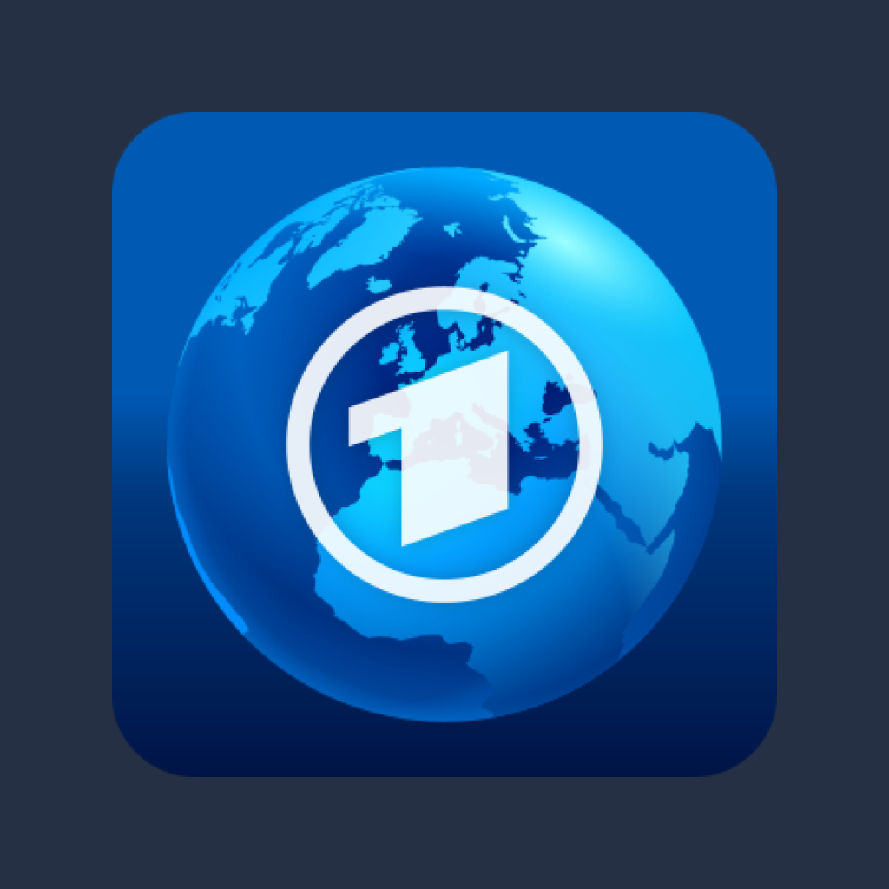

<p align="center">
  
</p>

<h1 align="center">Tagesschau Wirtschaft App</h1>

<p align="center">
The <b>much</b> needed wrapper for <a href="https://www.tagesschau.de/wirtschaft/">https://www.tagesschau.de/wirtschaft/</a>
</p>

<p align=center>
  <a href="https://www.tagesschau.de/wirtschaft/">Website</a> ·
  <a href="https://github.com/bieniasj/tagesschau-wirtschaft-wrapper/releases">Releases</a> 
</p>

---

## Description

This project wraps a [Capacitor](https://capacitorjs.com/) app which acts as a android and ios application wrapper for the [Tagesschau Wirtschaft](https://www.tagesschau.de/wirtschaft/) website

## Demo

No demo available yet

## Installation

### Android

Check out the releases page (https://github.com/bieniasj/tagesschau-wirtschaft-wrapper/releases) to download the latest version of the android apk

For further information on how to install an external apk, check out https://www.nextpit.com/android-for-beginners-what-is-an-apk-file

### iOS (Not recommended)

You need to run this app locally on your Macbook and run it via XCode. Check out https://ionicframework.com/docs/developing/ios for more information

## Run Locally

Clone the project

```bash
  git clone https://github.com/bieniasj/tagesschau-wirtschaft-wrapper.git
```

Go to the project directory

```bash
  cd tagesschau-wirtschaft-wrapper
```

Install dependencies

```bash
  npm install
```

Add Android / iOS platform

```bash
  # Android
  npx cap add android

  # iOS (Not recommended)
  npx cap add ios
```

Open Android Studio / XCode platform

```bash
  # Android
  npx cap open android
  # iOS (Not recommended)
  npx cap open ios
```

Running your app:

Checkout [Capacitor - Running your app](https://capacitorjs.com/docs/android#running-your-app)
on how to run your app.

## License

[MIT](https://choosealicense.com/licenses/mit/)

## Support

This project won't be maintained. It's just a hobby project that helps me in my daily routine. Feel free to clone or fork this project and do whatever you want with it.
